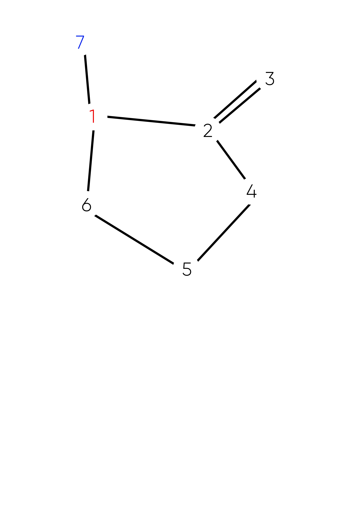

# Exercise 7.2.2.5
## Question
The graph defined by the following sets:
- N = {1, 2, 3, 4, 5, 6, 7}
- N0 = {1}
- Nf = {7}
- E = {(1, 2), (1, 7), (2, 3), (2, 4), (3, 2), (4, 5), (4, 6), (5, 6), (6, 1)}

Also consider the following (candidate) test paths:
- p1 = [1, 2, 4, 5, 6, 1, 7]
- p2 = [1, 2, 3, 2, 4, 6, 1, 7]
- p3 = [1, 2, 3, 2, 4, 5, 6, 1, 7]

### (a) Draw the graph.

### (b) List the test requirements for Edge-Pair Coverage.
13 requirements are needed for Edge-Pairs:
1. [1,2,3]
2. [1,2,4]
3. [1,7]
4. [2,3,2]
5. [2,4,5]
6. [2,4,6]
7. [3,2,3]
8. [3,2,4]
9. [4,5,6]
10. [4,6,1]
11. [5,6,1]
12. [6,1,2]
13. [6,1,7]
